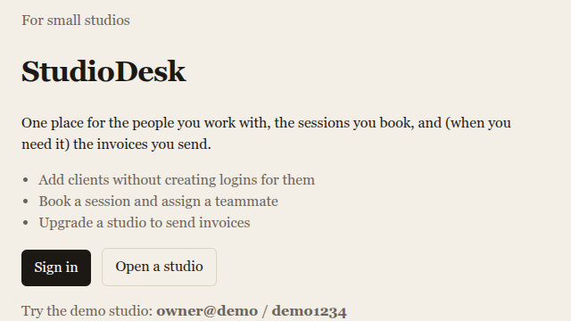
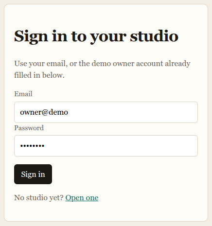
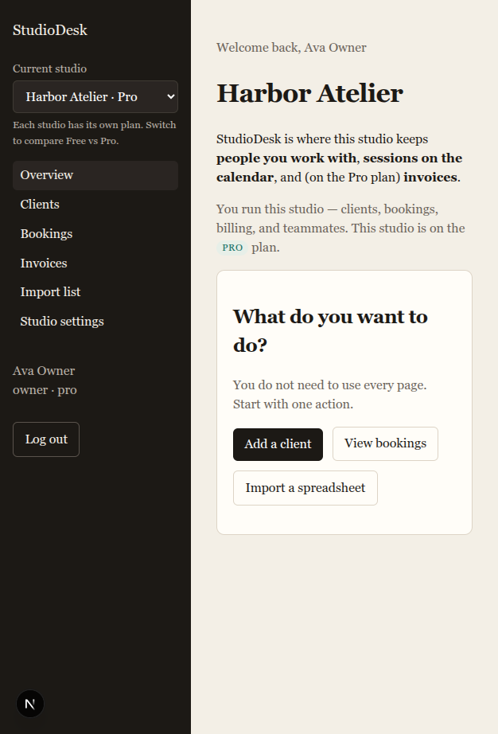
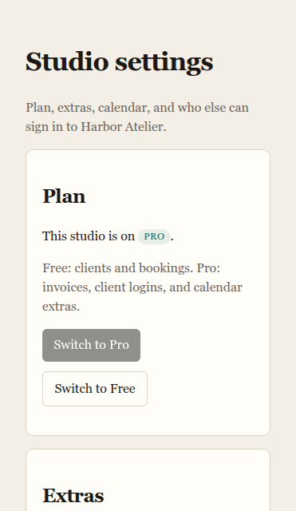
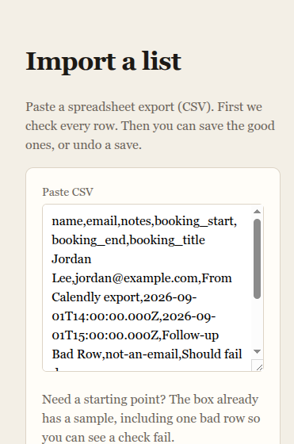

# StudioDesk

A client-operations app for small studios: people you work with, sessions on the calendar, and invoices when you need them.(it could be used for shops , clinic , online session etc ) 

Built as — **Next.js** UI, **Express** API, **PostgreSQL** + **Prisma**. The browser never talks to the database. Next.js rewrites `/api/*` to Express so cookies stay first-party.



## Demo

| | |
| --- | --- |
| App | http://localhost:3000 |
| Owner | `owner@demo` / `demo1234` |
| Manager | `manager@demo` / `demo1234` (cannot change the plan) |
| Studios | **Northshore** (Free) and **Harbor** (Pro) — switch in the sidebar |





Switching studios is the feature-flag demo: Invoices is in the menu on Pro, gone on Free. The flag follows the **studio**, not the user.

## What it does



- **Clients** are contacts, not logins. Importing a spreadsheet does not create 500 passwords.
- **Bookings** are sessions, optionally assigned to a teammate.
- **Invoices** exist when the studio’s plan (or an extra) turns them on.
- **Import** checks a CSV first, then you save the good rows or undo the save.



## Stack decisions (the interview bits)

| Choice | Why |
| --- | --- |
| Sessions in Postgres, httpOnly cookie | Log out deletes a row. Org switch does not mint JWTs. |
| `prismaForOrg(orgId)` | Tenant `orgId` is injected. A missed `WHERE` cannot leak another studio. |
| `authorize({ permission, flag })` | Roles are permission bundles. The plan is a set of flags. No `if (role === "admin")`. |
| Import `batchId` | Rollback is `DELETE WHERE importBatchId = ?`. |
| Stripe / Google webhooks | Event ids go in `ProcessedEvent` first so retries are no-ops. |

Two files to open:

- [`packages/db/src/tenant.ts`](packages/db/src/tenant.ts)
- [`apps/api/src/lib/authorize.ts`](apps/api/src/lib/authorize.ts)

## Run locally

Needs Docker, Node 22, and pnpm 9.

```bash
pnpm install
pnpm db:up
pnpm db:generate
pnpm db:migrate
pnpm db:seed
pnpm dev
```

- UI: http://localhost:3000
- API: http://localhost:4000/api/health (also available via the Next rewrite as `/api/health`)

Optional env (see `.env.example`): Stripe Checkout and Google Calendar. Without those keys the app still runs — Switch to Pro and Collect payment have a local stand-in.

## Layout

```
apps/web       Next.js App Router (no Prisma)
apps/api       Express + Zod
packages/db    Prisma schema, tenant extension, seed
docs/screenshots
```
